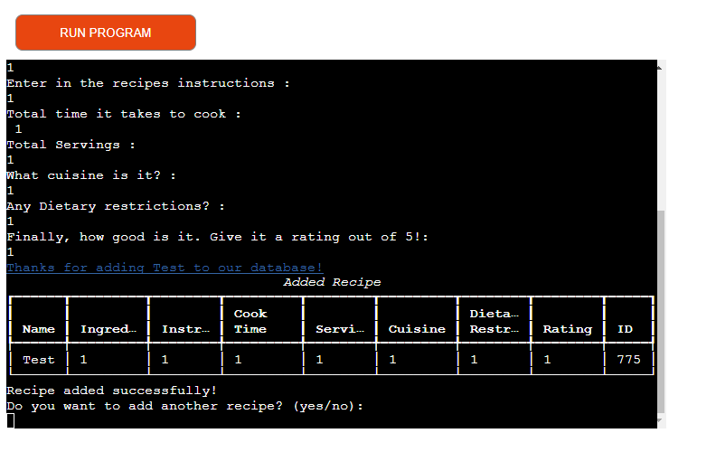
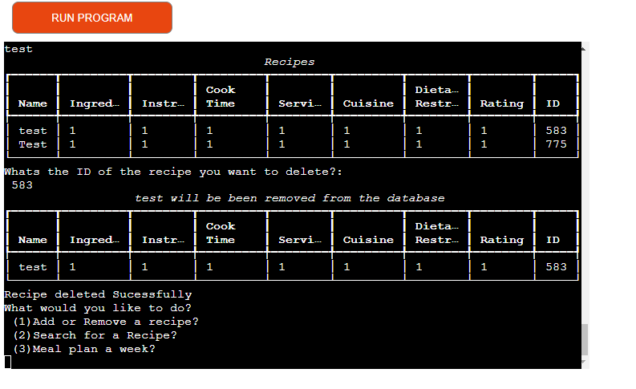
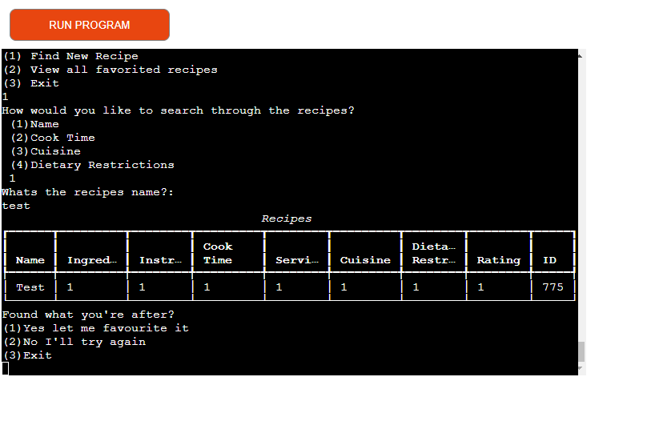

# Recipe Manager & Planner 

I’ve created a simple application that allows user to interact with a recipe database and plan meals for a certain number of days.

The deployed project live link is: https://recipe-manager-f0234092ebe1.herokuapp.com/

## Contents

- [Introduction](#introduction)
- [Project](#project)
  - [User goals:](#user-goals)
  - [Site owner goals](#site-owner-goals)
- [Pre development](#pre-development)
- [Development](#development)
- [Features](#features)
- [Google Sheets](#google-sheets)
- [Technologies Used](#technologies-used)
- [Resources](#resources)
  - [Libraries](#libraries)
- [Testing](#testing)
- [Future Updates](#future-updates)  
- [Validation](#validation)
- [Deployment](#deployment)
  - [Heroku](#heroku)
  - [Branching the GitHub Repository using GitHub Desktop and Visual Studio Code](#branching-the-github-repository-using-github-desktop-and-visual-studio-code)
- [Bugs](#bugs)
- [Credits](#credits)
- [Acknowledgements](#acknowledgements)

## Introduction

The portal allows the user to do 3 tasks, add/remove a recipe, search for recipes through various search terms, and add them to a favourite list, or create a meal plan of random recipes for a specific number of days.

## Project 

The aim of this project is to:

-	Search for recipes
-	Add recipes
-	Remove recipe 
-	Favourite recipes
-	Plan meals for X amount of days
-	
### User goals:

Get clear instructions on how to use the system in front of them that they can refer to if needed.
The ability to input a recipe that fits into the columns of the recipe manager spreadsheet 
Retrieve recipes based on various search terms e.g., Name, Time, Cuisine, Dietary restrictions 
Delete recipes from the database
Add favourited recipes to a separate worksheet
Generate a random amount of meals based on users input

### Site owner goals

Provide a program that is easy to use and maintain.
Present a program that gives clear instructions each time a user visits.
Develop a program that can have additional features added at a later date.

### Pre-development
I created a flow chart, whiteboard notes and a notion document.  All I had to do then was follow my notes and code one area at a time before moving on to the next, structuring the project into the 3 key areas. 

### Development

Phase 1. 
The initial coding phase was to connect the database and ensure data was able to be read at a basic level. I also had to populate the database with a set of recipes in the correct columns and structure. 
Phase 2. 
Phase 2 was to create the first main function, being able to read and search for recipes was crucial to the later parts of the project as the other functions are based on this initial search capability.
This went through multiple iterations as the version history states, until I was able to land on using a combination of the pandas & gpread libraries.
Phase 3
After this function had been figured out, it was much easier to build out the rest of the functions and add the delete/add aspects of the recipe manager. After these had been structured, the meal planner recipe function and the favourite list

## Features

### Add recipe
The user can add a recipe to the Google Sheets database, the app structures the input into each specific column and then adds a randomly generated ID to the recipe in order to search for the recipes in later functions. All inputs must be filled for the recipe to be added. 

### Delete Recipe
The user can search for all recipes associated with the name inputted, it then asks the user to input an id associated with the recipe and removes it from the database.

### Search for recipes
The user can search for a recipe based on multiple search inputs
-	Name 
-	Cuisine
-	Cook time
-	Dietary restrictions 
After all associated recipes have been found the user can either try again with a different search criterion or add the recipe to a separate worksheet on the database

### Favourited recipes 
Shows all recipes that have been favourited by the user

### Meal Planner
Allows the user to enter a specific number of days and create a meal plan with 3 meals for each day

## Technologies Used

The main technology used to create this program is Python
Google API
Google Sheets

### Resources

- Visual Studio Code (VSC)
- GitHub 
- Heroku
- Lucid 
- Notion 

### Libraries
-	gspread
-	time
-	random
-	pandas
-	rich

## Testing

Full Testing Doc can be seen here - TESTING.md

## Future Updates
Allow the user to add their name a bespoke to application to their inputs 

## Validation

PEP8 - Python style guide checker imported - https://pypi.org/project/pep8/
All code validated and where lines were showing as too long they were adjusted. Some line adjustments caused bugs in the code and it stopped working so they were left as longer lines to avoid this issue. pycodestyle . - was used in Codeanywhere terminal to list any issues.

## Deployment

### Heroku

The Application has been deployed from GitHub to Heroku by following the steps:

1. Create or log in to your account at heroku.com
2. Create a new app, add a unique app name (recipemanager) and then choose your region
3. Click on create app
4. Go to "Settings"
5. Under Config Vars add the private API key information using key 'CRED' and into the value area copy the API key information added to the .json file.  Also add a key 'PORT' and value '8000'.
6. Add required buildpacks (further dependencies). For this project, set it up so Python will be on top and Node.js on bottom
7. Go to "Deploy" and select "GitHub" in "Deployment method"
8. To connect Heroku app to your Github repository code enter your repository name, click 'Search' and then 'Connect' when it shows below.
9.  Choose the branch you want to build your app from
10. If preferred, click on "Enable Automatic Deploys", which keeps the app up to date with your GitHub repository
11. Wait for the app to build. Once ready you will see the “App was successfully deployed” message and a 'View' button to take you to your deployed link.

### Branching the GitHub Repository using GitHub Desktop and Visual Studio Code
1. Go to the GitHub repository.
2. Click on the branch button in the left hand side under the repository name.
3. Give your branch a name.
4. Go to the CODE area on the right and select "Open with GitHub Desktop".
5. You will be asked if you want to clone the repository - say yes.
6. GitHub desktop will suggest what to do next - select Open code using Visual Studio Code.

## Bugs

## Credits
https://www.quora.com/How-do-I-convert-3-into-1-2-3-in-Python (Source 1)

## Acknowledgements

